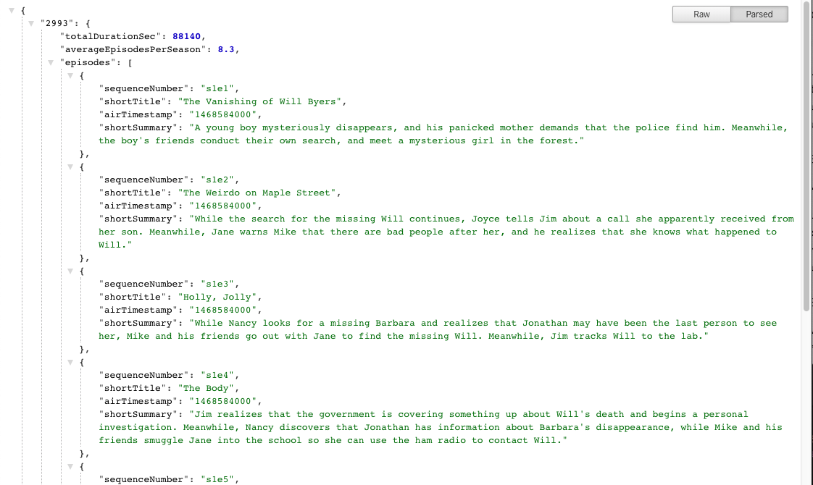

<h1 align="center">Simple NODE/REST API calls with tests</h1>

## What is this and who is it for 🤷‍♀️

This is just a work assignment where I had to:

- Create an Node application to connect to the api.tvmaze.com api

## Reformat Data

- Total duration of the show, across all episodes (seconds)
- Average episodes per season, float with max one decimal (e.g. 5.3)
- s<X>e<Y> // Episode and season number, e.g. "s1e1"
- Air timestamp in epoch time (seconds)
- First sentence of the summary, without HTML tags

## Setting up development environment 🛠

- clone the repo and change directory to ./show_api
- `npm run install`
- `npm run start`
- The app should now be running on `http://localhost:8080/`
- To see the JSON data go to `http://localhost:8080/api/show?name=stranger-things`

## Tests 🚥

- change directory to ./show_api
- `npm run test`

## What's missing?

Due to time limit on this assigment a better UI would be nice, more comprensive test are also in order

### Author: Pablo H Giani ✍️

### License

[GPL3.0](https://github.com/pgiani/show_api/blob/master/LICENSE)
